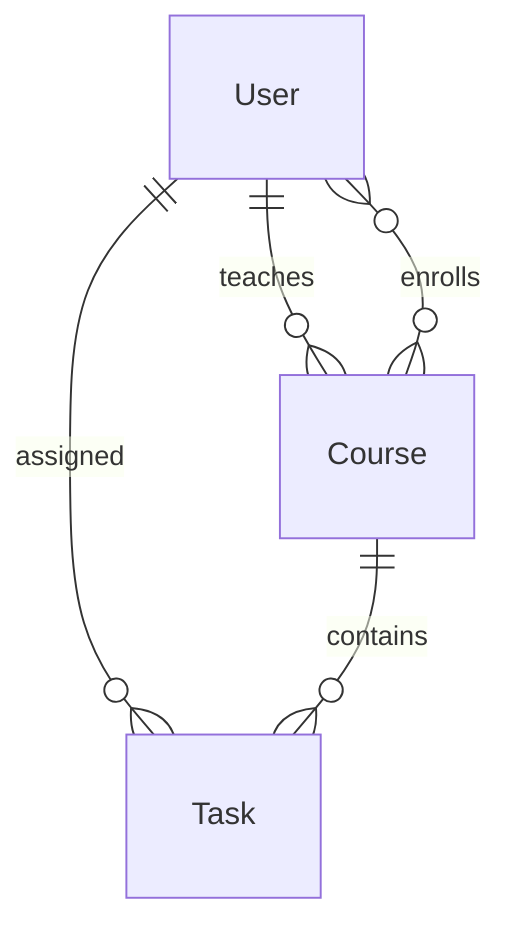

# 数据库设计文档

## 数据模型

### User（用户）
```prisma
model User {
  id        String   @id @default(cuid())
  name      String
  email     String   @unique
  password  String
  role      Role     @default(STUDENT)
  createdAt DateTime @default(now())
  updatedAt DateTime @updatedAt
}

enum Role {
  ADMIN
  TEACHER
  STUDENT
}
```

### Course（课程）
```prisma
model Course {
  id          String   @id @default(cuid())
  title       String
  description String?
  teacherId   String
  teacher     User     @relation(fields: [teacherId], references: [id])
  students    User[]   @relation("CourseEnrollments")
  createdAt   DateTime @default(now())
  updatedAt   DateTime @updatedAt
}
```

### Task（任务）
```prisma
model Task {
  id          String     @id @default(cuid())
  title       String
  description String?
  status      TaskStatus @default(TODO)
  priority    Priority   @default(MEDIUM)
  dueDate     DateTime?
  assigneeId  String?
  assignee    User?      @relation(fields: [assigneeId], references: [id])
  courseId    String?
  course      Course?    @relation(fields: [courseId], references: [id])
  createdAt   DateTime   @default(now())
  updatedAt   DateTime   @updatedAt
}

enum TaskStatus {
  TODO
  IN_PROGRESS
  DONE
}

enum Priority {
  LOW
  MEDIUM
  HIGH
}
```

## 关系图



## 索引设计

1. User 表
   - email: 唯一索引
   - role: 普通索引

2. Course 表
   - teacherId: 外键索引
   - title: 普通索引

3. Task 表
   - assigneeId: 外键索引
   - courseId: 外键索引
   - status: 普通索引
   - dueDate: 普通索引

## 数据迁移

使用 Prisma Migrate 进行数据库迁移：

```bash
# 创建迁移
pnpm prisma migrate dev --name init

# 应用迁移
pnpm prisma migrate deploy

# 重置数据库
pnpm prisma migrate reset
```

## 数据验证

使用 Zod 进行数据验证：

```typescript
import { z } from 'zod';

export const UserSchema = z.object({
  name: z.string().min(2).max(50),
  email: z.string().email(),
  password: z.string().min(6),
  role: z.enum(['ADMIN', 'TEACHER', 'STUDENT'])
});

export const CourseSchema = z.object({
  title: z.string().min(2).max(100),
  description: z.string().optional(),
  teacherId: z.string()
});

export const TaskSchema = z.object({
  title: z.string().min(2).max(100),
  description: z.string().optional(),
  status: z.enum(['TODO', 'IN_PROGRESS', 'DONE']),
  priority: z.enum(['LOW', 'MEDIUM', 'HIGH']),
  dueDate: z.date().optional(),
  assigneeId: z.string().optional(),
  courseId: z.string().optional()
});
``` 