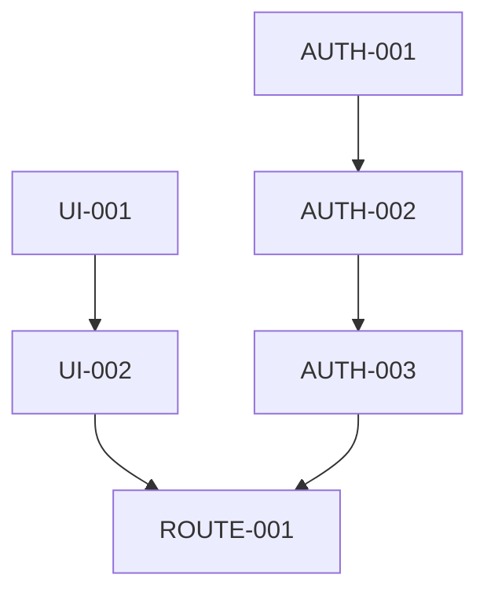

# v0.1.0 基础架构与用户认证任务分解

## 任务属性说明
每个任务包含以下属性：
- 任务ID：唯一标识符
- 任务名称：简短描述
- 任务描述：详细说明
- 相关文件：涉及的文件路径
- 依赖任务：前置任务ID
- AI提示词：用于生成代码的提示词

## 任务列表

### 1. 用户认证系统
#### 1.1 用户模型设计
- 任务ID: AUTH-001
- 任务名称: 设计用户数据模型
- 任务描述: 设计用户相关的数据模型，包括用户基本信息、认证信息等
- 相关文件: 
  - prisma/schema.prisma
  - src/types/index.ts
- 依赖任务: 无
- AI提示词: "设计一个教育平台用户数据模型，包含以下字段：id、email、name、password、role(学生/教师/管理员)、createdAt、updatedAt。使用Prisma Schema格式。"

#### 1.2 认证API实现
- 任务ID: AUTH-002
- 任务名称: 实现用户认证API
- 任务描述: 实现用户注册、登录、登出等认证相关的API接口
- 相关文件:
  - src/app/api/auth/register/route.ts
  - src/app/api/auth/login/route.ts
  - src/app/api/auth/logout/route.ts
- 依赖任务: AUTH-001
- AI提示词: "实现用户注册API，包含以下功能：1. 验证用户输入 2. 密码加密 3. 创建用户记录 4. 返回JWT令牌。使用Next.js API Routes。"

#### 1.3 认证中间件
- 任务ID: AUTH-003
- 任务名称: 实现认证中间件
- 任务描述: 实现用于保护API路由的认证中间件
- 相关文件:
  - src/middleware.ts
- 依赖任务: AUTH-002
- AI提示词: "实现一个Next.js中间件，用于验证JWT令牌并保护API路由。包含以下功能：1. 验证令牌有效性 2. 提取用户信息 3. 处理未认证请求。"

### 2. 基础UI组件
#### 2.1 布局组件
- 任务ID: UI-001
- 任务名称: 实现基础布局组件
- 任务描述: 实现包含导航栏、侧边栏等的基础布局组件
- 相关文件:
  - src/components/layout/Header.tsx
  - src/components/layout/Sidebar.tsx
  - src/components/layout/Layout.tsx
- 依赖任务: 无
- AI提示词: "实现一个响应式的教育平台布局组件，包含顶部导航栏和侧边菜单。使用Tailwind CSS进行样式设计。"

#### 2.2 表单组件
- 任务ID: UI-002
- 任务名称: 实现基础表单组件
- 任务描述: 实现登录、注册等表单组件
- 相关文件:
  - src/components/auth/LoginForm.tsx
  - src/components/auth/RegisterForm.tsx
- 依赖任务: UI-001
- AI提示词: "实现一个用户登录表单组件，包含邮箱和密码输入框，以及提交按钮。使用React Hook Form进行表单管理。"

### 3. 路由系统
#### 3.1 页面路由
- 任务ID: ROUTE-001
- 任务名称: 实现基础页面路由
- 任务描述: 实现登录、注册、主页等基础页面路由
- 相关文件:
  - src/app/(auth)/login/page.tsx
  - src/app/(auth)/register/page.tsx
  - src/app/(main)/dashboard/page.tsx
- 依赖任务: UI-002
- AI提示词: "实现用户登录页面，包含以下功能：1. 集成登录表单组件 2. 处理表单提交 3. 错误提示 4. 登录成功后跳转。"

## 任务依赖关系
