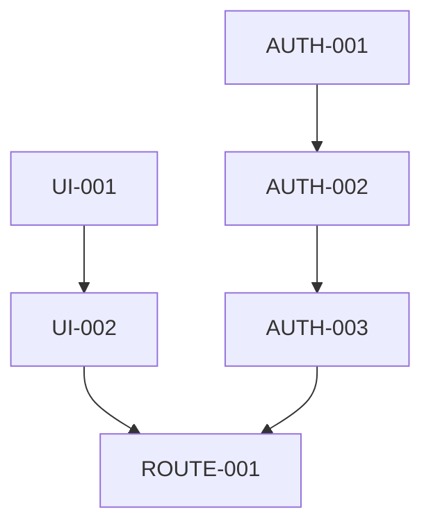

# v0.1.0 任务分解

## 用户认证系统

### AUTH-001: 用户模型设计
- 状态：✅ 已完成
- 描述：设计用户数据模型，包括基本信息和认证相关字段
- 相关文件：
  - `prisma/schema.prisma`
  - `src/types/index.ts`
  - `src/lib/db/__tests__/user.test.ts`
- 依赖任务：无
- AI提示词：
  ```
  请帮我设计用户数据模型，包括以下要求：
  1. 基本信息：用户名、邮箱、密码等
  2. 角色权限：学生、教师、管理员
  3. 关联信息：任务、评论、通知等
  4. 时间戳：创建时间、更新时间
  ```
- 备注：使用字符串字面量类型替代枚举，以符合开发规范

### AUTH-002: 认证API实现
- 状态：✅ 已完成
- 描述：实现用户注册、登录、登出等认证API
- 相关文件：
  - `src/app/api/auth/[...nextauth]/route.ts`
  - `src/lib/auth/index.ts`
  - `src/lib/auth/__tests__/auth.test.ts`
- 依赖任务：AUTH-001
- AI提示词：
  ```
  请帮我实现用户认证API，包括以下功能：
  1. 用户注册
  2. 用户登录
  3. 用户登出
  4. 密码重置
  5. 邮箱验证
  ```
- 备注：使用字符串字面量类型替代枚举，确保与用户模型一致
- 完成情况：
  - ✅ 创建认证工具函数
  - ✅ 实现NextAuth配置
  - ✅ 实现用户注册API
  - ✅ 编写单元测试
  - ✅ 执行单元测试

### AUTH-003: 认证中间件
- 状态：✅ 已完成
- 描述：实现认证中间件，保护需要认证的路由
- 相关文件：
  - `src/middleware.ts`
  - `src/middleware.test.ts`
- 依赖任务：AUTH-002
- AI提示词：
  ```
  请帮我实现认证中间件，包括以下功能：
  1. 路由保护
  2. 角色权限控制
  3. 会话管理
  ```
- 备注：使用字符串字面量类型替代枚举，保持与认证API一致
- 完成情况：
  - ✅ 创建中间件文件
  - ✅ 实现路由保护
  - ✅ 实现角色权限控制
  - ✅ 编写单元测试
  - ✅ 执行单元测试

## 基础UI组件

### UI-001: 布局组件
- 状态：✅ 已完成
- 描述：实现基础布局组件，包括导航栏、侧边栏等
- 相关文件：
  - `src/components/layout/Header.tsx`
  - `src/components/layout/Sidebar.tsx`
  - `src/components/layout/Footer.tsx`
  - `src/components/layout/Layout.tsx`
  - `src/components/layout/__tests__/*.test.tsx`
- 依赖任务：无
- AI提示词：
  ```
  请帮我实现基础布局组件，包括以下要求：
  1. 响应式导航栏
  2. 可折叠侧边栏
  3. 页面布局容器
  4. 页脚组件
  ```
- 备注：
  - 使用字符串字面量类型替代枚举，确保与用户认证系统一致
  - 完成所有组件的单元测试
  - 实现响应式设计，支持移动端和桌面端

### UI-002: 表单组件
- 状态：✅ 已完成
- 描述：实现基础表单组件，包括输入框、按钮等
- 相关文件：
  - src/components/form/Input.tsx
  - src/components/form/Button.tsx
  - src/components/form/Select.tsx
  - src/components/form/__tests__/Input.test.tsx
  - src/components/form/__tests__/Button.test.tsx
  - src/components/form/__tests__/Select.test.tsx
- 依赖任务：无
- AI提示词：
  ```
  请帮我实现基础表单组件，包括以下要求：
  1. 输入框组件
  2. 按钮组件
  3. 选择器组件
  4. 表单验证
  ```
- 完成情况：
  - ✅ Input组件
    - 基础输入框功能
    - 支持不同类型（text, password, email等）
    - 支持错误状态显示
    - 支持禁用状态
    - 支持标签和占位符
    - 完成单元测试
  - ✅ Button组件
    - 支持不同类型（primary, secondary, danger）
    - 支持不同大小（small, medium, large）
    - 支持禁用状态
    - 支持加载状态
    - 支持图标
    - 完成单元测试
  - ✅ Select组件
    - 基础下拉选择功能
    - 支持选项禁用
    - 支持错误状态显示
    - 支持禁用状态
    - 支持标签和占位符
    - 完成单元测试

### UI-003: 数据展示组件
- 状态：✅ 已完成
- 描述：实现数据展示组件，包括表格、列表等
- 相关文件：
  - src/components/display/Table.tsx
  - src/components/display/List.tsx
  - src/components/display/Card.tsx
  - src/components/display/__tests__/Table.test.tsx
  - src/components/display/__tests__/List.test.tsx
  - src/components/display/__tests__/Card.test.tsx
- 依赖任务：无
- AI提示词：
  ```
  请帮我实现数据展示组件，包括以下要求：
  1. 表格组件
  2. 列表组件
  3. 卡片组件
  4. 加载状态
  ```
- 完成情况：
  - ✅ Table组件
    - 基础表格功能
    - 支持自定义列配置
    - 支持排序
    - 支持空状态
    - 支持加载状态
    - 完成单元测试
  - ✅ List组件
    - 基础列表功能
    - 支持自定义项目渲染
    - 支持空状态
    - 支持加载状态
    - 支持分割线
    - 支持操作项
    - 完成单元测试
  - ✅ Card组件
    - 基础卡片布局
    - 支持标题和内容
    - 支持自定义操作
    - 支持加载状态
    - 支持图片展示
    - 支持阴影和边框样式
    - 完成单元测试

### UI-004: 反馈组件
- 状态：✅ 已完成
- 描述：实现反馈组件，包括弹窗、消息提示等
- 相关文件：
  - src/components/feedback/Modal.tsx
  - src/components/feedback/Message.tsx
  - src/components/feedback/Notification.tsx
  - src/components/feedback/__tests__/Modal.test.tsx
  - src/components/feedback/__tests__/Message.test.tsx
  - src/components/feedback/__tests__/Notification.test.tsx
- 依赖任务：无
- AI提示词：
  ```
  请帮我实现反馈组件，包括以下要求：
  1. 弹窗组件
  2. 消息提示组件
  3. 通知组件
  4. 加载状态
  ```
- 完成情况：
  - ✅ Modal组件
    - 基础对话框
    - 支持自定义标题和内容
    - 支持自定义按钮
    - 支持自定义宽度
    - 支持显示/隐藏遮罩层
    - 支持ESC关闭
    - 相关文件：
      - src/components/feedback/Modal.tsx
      - src/components/feedback/__tests__/Modal.test.tsx
  - ✅ Message组件
    - 基础消息提示
    - 支持不同类型（success、error、warning、info）
    - 支持自动关闭
    - 支持手动关闭
    - 支持自定义显示时间
    - 相关文件：
      - src/components/feedback/Message.tsx
      - src/components/feedback/__tests__/Message.test.tsx
  - ✅ Notification组件
    - 基础通知提示
    - 支持不同类型（success、error、warning、info）
    - 支持标题和内容
    - 支持自定义图标
    - 支持自动关闭
    - 支持手动关闭
    - 支持自定义显示时间
    - 支持自定义位置
    - 相关文件：
      - src/components/feedback/Notification.tsx
      - src/components/feedback/__tests__/Notification.test.tsx

## 任务列表

### 1. 用户认证系统
#### 1.1 用户模型设计
- 任务ID: AUTH-001
- 任务名称: 设计用户数据模型
- 任务描述: 设计用户相关的数据模型，包括用户基本信息、认证信息等
- 相关文件: 
  - prisma/schema.prisma
  - src/types/index.ts
- 依赖任务: 无
- AI提示词: "设计一个教育平台用户数据模型，包含以下字段：id、email、name、password、role(学生/教师/管理员)、createdAt、updatedAt。使用Prisma Schema格式。"

#### 1.2 认证API实现
- 任务ID: AUTH-002
- 任务名称: 实现用户认证API
- 任务描述: 实现用户注册、登录、登出等认证相关的API接口
- 相关文件:
  - src/app/api/auth/register/route.ts
  - src/app/api/auth/login/route.ts
  - src/app/api/auth/logout/route.ts
- 依赖任务: AUTH-001
- AI提示词: "实现用户注册API，包含以下功能：1. 验证用户输入 2. 密码加密 3. 创建用户记录 4. 返回JWT令牌。使用Next.js API Routes。"

#### 1.3 认证中间件
- 任务ID: AUTH-003
- 任务名称: 实现认证中间件
- 任务描述: 实现用于保护API路由的认证中间件
- 相关文件:
  - src/middleware.ts
- 依赖任务: AUTH-002
- AI提示词: "实现一个Next.js中间件，用于验证JWT令牌并保护API路由。包含以下功能：1. 验证令牌有效性 2. 提取用户信息 3. 处理未认证请求。"

### 2. 基础UI组件
#### 2.1 布局组件
- 任务ID: UI-001
- 任务名称: 实现基础布局组件
- 任务描述: 实现包含导航栏、侧边栏等的基础布局组件
- 相关文件:
  - src/components/layout/Header.tsx
  - src/components/layout/Sidebar.tsx
  - src/components/layout/Footer.tsx
  - src/components/layout/Layout.tsx
  - src/components/layout/__tests__/*.test.tsx
- 依赖任务: 无
- AI提示词: "实现一个响应式的教育平台布局组件，包含顶部导航栏和侧边菜单。使用Tailwind CSS进行样式设计。"

#### 2.2 表单组件
- 任务ID: UI-002
- 任务名称: 实现基础表单组件
- 任务描述: 实现登录、注册等表单组件
- 相关文件:
  - src/components/auth/LoginForm.tsx
  - src/components/auth/RegisterForm.tsx
- 依赖任务: UI-001
- AI提示词: "实现一个用户登录表单组件，包含邮箱和密码输入框，以及提交按钮。使用React Hook Form进行表单管理。"

### 3. 路由系统
#### 3.1 页面路由
- 任务ID: ROUTE-001
- 任务名称: 实现基础页面路由
- 任务描述: 实现登录、注册、主页等基础页面路由
- 相关文件:
  - src/app/(auth)/login/page.tsx
  - src/app/(auth)/register/page.tsx
  - src/app/(main)/dashboard/page.tsx
- 依赖任务: UI-002
- AI提示词: "实现用户登录页面，包含以下功能：1. 集成登录表单组件 2. 处理表单提交 3. 错误提示 4. 登录成功后跳转。"

## 任务依赖关系
