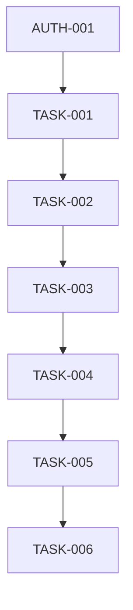

# v0.2.0 任务管理核心功能任务分解

## 任务属性说明
每个任务包含以下属性：
- 任务ID：唯一标识符
- 任务名称：简短描述
- 任务描述：详细说明
- 相关文件：涉及的文件路径
- 依赖任务：前置任务ID
- AI提示词：用于生成代码的提示词

## 任务列表

### 1. 任务数据模型
#### 1.1 任务模型设计
- 任务ID: TASK-001
- 任务名称: 设计任务数据模型
- 任务描述: 设计任务相关的数据模型，包括任务基本信息、状态、优先级等
- 相关文件: 
  - prisma/schema.prisma
  - src/types/index.ts
- 依赖任务: AUTH-001
- AI提示词: "设计一个教育平台任务数据模型，包含以下字段：id、title、description、status(TODO/IN_PROGRESS/DONE)、priority(LOW/MEDIUM/HIGH)、dueDate、userId、createdAt、updatedAt。使用Prisma Schema格式。"

### 2. 任务管理API
#### 2.1 任务CRUD API
- 任务ID: TASK-002
- 任务名称: 实现任务CRUD API
- 任务描述: 实现任务的创建、读取、更新、删除API接口
- 相关文件:
  - src/app/api/tasks/route.ts
  - src/app/api/tasks/[id]/route.ts
- 依赖任务: TASK-001
- AI提示词: "实现任务管理的RESTful API，包含以下功能：1. 创建任务 2. 获取任务列表 3. 获取单个任务 4. 更新任务 5. 删除任务。使用Next.js API Routes。"

#### 2.2 任务状态管理API
- 任务ID: TASK-003
- 任务名称: 实现任务状态管理API
- 任务描述: 实现任务状态变更、批量操作等API接口
- 相关文件:
  - src/app/api/tasks/[id]/status/route.ts
  - src/app/api/tasks/batch/route.ts
- 依赖任务: TASK-002
- AI提示词: "实现任务状态管理API，包含以下功能：1. 更新任务状态 2. 批量更新任务状态 3. 任务排序 4. 任务筛选。使用Next.js API Routes。"

### 3. 任务管理UI
#### 3.1 任务列表组件
- 任务ID: TASK-004
- 任务名称: 实现任务列表组件
- 任务描述: 实现任务列表展示、筛选、排序等功能
- 相关文件:
  - src/components/tasks/TaskList.tsx
  - src/components/tasks/TaskFilters.tsx
  - src/components/tasks/TaskSort.tsx
- 依赖任务: TASK-003
- AI提示词: "实现任务列表组件，包含以下功能：1. 任务卡片展示 2. 状态筛选 3. 优先级排序 4. 截止日期排序。使用React和Tailwind CSS。"

#### 3.2 任务表单组件
- 任务ID: TASK-005
- 任务名称: 实现任务表单组件
- 任务描述: 实现任务创建、编辑表单组件
- 相关文件:
  - src/components/tasks/TaskForm.tsx
  - src/components/tasks/TaskModal.tsx
- 依赖任务: TASK-004
- AI提示词: "实现任务表单组件，包含以下功能：1. 任务标题输入 2. 任务描述输入 3. 截止日期选择 4. 优先级选择 5. 表单验证。使用React Hook Form。"

### 4. 任务管理页面
#### 4.1 任务管理主页面
- 任务ID: TASK-006
- 任务名称: 实现任务管理主页面
- 任务描述: 实现任务管理的主页面，集成任务列表和表单组件
- 相关文件:
  - src/app/(main)/tasks/page.tsx
  - src/app/(main)/tasks/[id]/page.tsx
- 依赖任务: TASK-005
- AI提示词: "实现任务管理主页面，包含以下功能：1. 集成任务列表组件 2. 集成任务表单组件 3. 任务详情展示 4. 任务编辑功能。使用Next.js App Router。"

## 任务依赖关系
