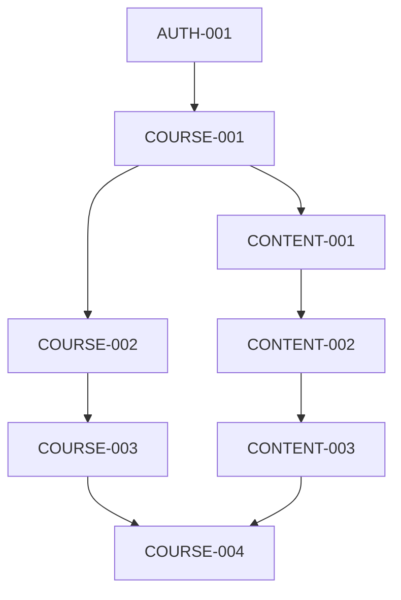

# v0.3.0 教务管理功能任务分解

## 任务属性说明
每个任务包含以下属性：
- 任务ID：唯一标识符
- 任务名称：简短描述
- 任务描述：详细说明
- 相关文件：涉及的文件路径
- 依赖任务：前置任务ID
- AI提示词：用于生成代码的提示词

## 任务列表

### 1. 课程管理
#### 1.1 课程模型设计
- 任务ID: COURSE-001
- 任务名称: 设计课程数据模型
- 任务描述: 设计课程相关的数据模型，包括课程信息、教师、学生等
- 相关文件: 
  - prisma/schema.prisma
  - src/types/index.ts
- 依赖任务: AUTH-001
- AI提示词: "设计一个教育平台课程数据模型，包含以下字段：id、name、description、teacherId、students(关联用户)、schedule、location、createdAt、updatedAt。使用Prisma Schema格式。"

#### 1.2 课程管理API
- 任务ID: COURSE-002
- 任务名称: 实现课程管理API
- 任务描述: 实现课程的创建、更新、删除、学生管理等API接口
- 相关文件:
  - src/app/api/courses/route.ts
  - src/app/api/courses/[id]/route.ts
  - src/app/api/courses/[id]/students/route.ts
- 依赖任务: COURSE-001
- AI提示词: "实现课程管理的RESTful API，包含以下功能：1. 创建课程 2. 更新课程信息 3. 添加/删除学生 4. 获取课程列表 5. 获取课程详情。使用Next.js API Routes。"

### 2. 课程内容管理
#### 2.1 课程内容模型设计
- 任务ID: CONTENT-001
- 任务名称: 设计课程内容数据模型
- 任务描述: 设计课程内容相关的数据模型，包括章节、资源等
- 相关文件: 
  - prisma/schema.prisma
  - src/types/index.ts
- 依赖任务: COURSE-001
- AI提示词: "设计一个教育平台课程内容数据模型，包含以下字段：id、courseId、title、content、type(文档/视频/作业)、order、createdAt、updatedAt。使用Prisma Schema格式。"

#### 2.2 课程内容API
- 任务ID: CONTENT-002
- 任务名称: 实现课程内容API
- 任务描述: 实现课程内容的创建、更新、删除等API接口
- 相关文件:
  - src/app/api/courses/[id]/contents/route.ts
  - src/app/api/courses/[id]/contents/[contentId]/route.ts
- 依赖任务: CONTENT-001
- AI提示词: "实现课程内容管理的RESTful API，包含以下功能：1. 创建课程内容 2. 更新内容 3. 删除内容 4. 内容排序 5. 内容列表获取。使用Next.js API Routes。"

### 3. 课程UI组件
#### 3.1 课程列表组件
- 任务ID: COURSE-003
- 任务名称: 实现课程列表组件
- 任务描述: 实现课程列表展示、筛选等功能
- 相关文件:
  - src/components/courses/CourseList.tsx
  - src/components/courses/CourseCard.tsx
- 依赖任务: COURSE-002
- AI提示词: "实现课程列表组件，包含以下功能：1. 课程卡片展示 2. 课程分类筛选 3. 课程搜索 4. 课程状态显示。使用React和Tailwind CSS。"

#### 3.2 课程内容组件
- 任务ID: CONTENT-003
- 任务名称: 实现课程内容组件
- 任务描述: 实现课程内容的展示、编辑等功能
- 相关文件:
  - src/components/courses/CourseContent.tsx
  - src/components/courses/ContentEditor.tsx
- 依赖任务: CONTENT-002
- AI提示词: "实现课程内容组件，包含以下功能：1. 内容树形展示 2. 内容编辑器 3. 内容预览 4. 内容排序。使用React和Tailwind CSS。"

### 4. 课程管理页面
#### 4.1 课程管理主页面
- 任务ID: COURSE-004
- 任务名称: 实现课程管理主页面
- 任务描述: 实现课程管理的主页面，集成课程列表和内容管理
- 相关文件:
  - src/app/(main)/courses/page.tsx
  - src/app/(main)/courses/[id]/page.tsx
  - src/app/(main)/courses/[id]/contents/page.tsx
- 依赖任务: CONTENT-003
- AI提示词: "实现课程管理主页面，包含以下功能：1. 集成课程列表组件 2. 集成课程内容组件 3. 课程详情展示 4. 内容管理功能。使用Next.js App Router。"

## 任务依赖关系
