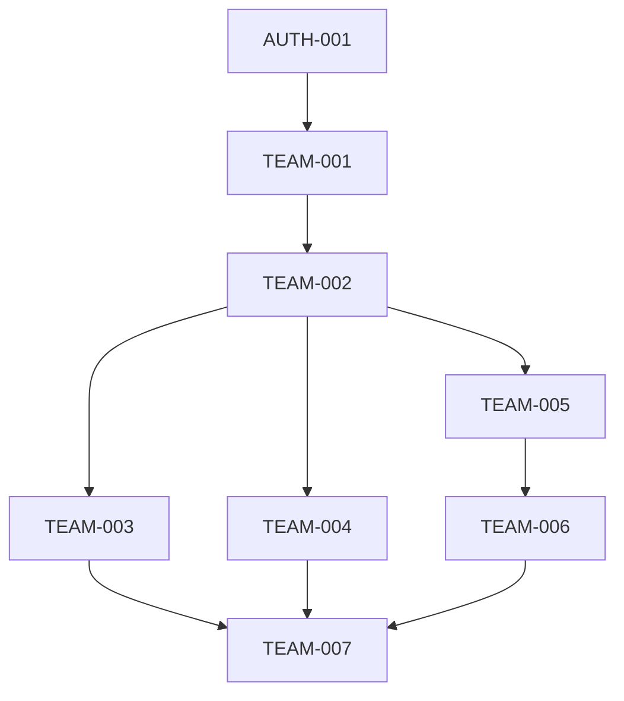

# v0.4.0 团队协作功能任务分解

## 任务属性说明
每个任务包含以下属性：
- 任务ID：唯一标识符
- 任务名称：简短描述
- 任务描述：详细说明
- 相关文件：涉及的文件路径
- 依赖任务：前置任务ID
- AI提示词：用于生成代码的提示词

## 任务列表

### 1. 团队管理
#### 1.1 团队模型设计
- 任务ID: TEAM-001
- 任务名称: 设计团队数据模型
- 任务描述: 设计团队相关的数据模型，包括团队信息、成员、角色等
- 相关文件: 
  - prisma/schema.prisma
  - src/types/index.ts
- 依赖任务: AUTH-001
- AI提示词: "设计一个教育平台团队数据模型，包含以下字段：id、name、description、leaderId、members(关联用户)、createdAt、updatedAt。使用Prisma Schema格式。"

#### 1.2 团队管理API
- 任务ID: TEAM-002
- 任务名称: 实现团队管理API
- 任务描述: 实现团队的创建、更新、删除、成员管理等API接口
- 相关文件:
  - src/app/api/teams/route.ts
  - src/app/api/teams/[id]/route.ts
  - src/app/api/teams/[id]/members/route.ts
- 依赖任务: TEAM-001
- AI提示词: "实现团队管理的RESTful API，包含以下功能：1. 创建团队 2. 更新团队信息 3. 添加/删除成员 4. 获取团队列表 5. 获取团队详情。使用Next.js API Routes。"

### 2. 团队协作功能
#### 2.1 团队讨论功能
- 任务ID: TEAM-003
- 任务名称: 实现团队讨论功能
- 任务描述: 实现团队内部的讨论、评论功能
- 相关文件:
  - prisma/schema.prisma
  - src/app/api/teams/[id]/discussions/route.ts
  - src/components/teams/DiscussionList.tsx
  - src/components/teams/DiscussionForm.tsx
- 依赖任务: TEAM-002
- AI提示词: "实现团队讨论功能，包含以下功能：1. 创建讨论 2. 回复讨论 3. 讨论列表展示 4. 讨论搜索。使用Next.js API Routes和React组件。"

#### 2.2 团队文件共享
- 任务ID: TEAM-004
- 任务名称: 实现团队文件共享功能
- 任务描述: 实现团队文件的上传、下载、管理功能
- 相关文件:
  - prisma/schema.prisma
  - src/app/api/teams/[id]/files/route.ts
  - src/components/teams/FileList.tsx
  - src/components/teams/FileUpload.tsx
- 依赖任务: TEAM-002
- AI提示词: "实现团队文件共享功能，包含以下功能：1. 文件上传 2. 文件下载 3. 文件列表展示 4. 文件权限管理。使用Next.js API Routes和React组件。"

### 3. 团队UI组件
#### 3.1 团队列表组件
- 任务ID: TEAM-005
- 任务名称: 实现团队列表组件
- 任务描述: 实现团队列表展示、筛选等功能
- 相关文件:
  - src/components/teams/TeamList.tsx
  - src/components/teams/TeamCard.tsx
- 依赖任务: TEAM-002
- AI提示词: "实现团队列表组件，包含以下功能：1. 团队卡片展示 2. 团队搜索 3. 成员数量显示 4. 团队状态显示。使用React和Tailwind CSS。"

#### 3.2 团队详情组件
- 任务ID: TEAM-006
- 任务名称: 实现团队详情组件
- 任务描述: 实现团队详情展示、成员管理等功能
- 相关文件:
  - src/components/teams/TeamDetail.tsx
  - src/components/teams/MemberList.tsx
- 依赖任务: TEAM-005
- AI提示词: "实现团队详情组件，包含以下功能：1. 团队信息展示 2. 成员列表展示 3. 成员管理 4. 团队设置。使用React和Tailwind CSS。"

### 4. 团队管理页面
#### 4.1 团队管理主页面
- 任务ID: TEAM-007
- 任务名称: 实现团队管理主页面
- 任务描述: 实现团队管理的主页面，集成团队列表和详情组件
- 相关文件:
  - src/app/(main)/teams/page.tsx
  - src/app/(main)/teams/[id]/page.tsx
  - src/app/(main)/teams/[id]/discussions/page.tsx
  - src/app/(main)/teams/[id]/files/page.tsx
- 依赖任务: TEAM-006
- AI提示词: "实现团队管理主页面，包含以下功能：1. 集成团队列表组件 2. 集成团队详情组件 3. 团队讨论功能 4. 团队文件共享。使用Next.js App Router。"

## 任务依赖关系
