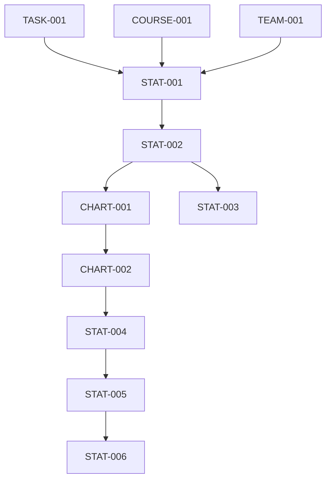

# v0.5.0 数据统计功能任务分解

## 任务属性说明
每个任务包含以下属性：
- 任务ID：唯一标识符
- 任务名称：简短描述
- 任务描述：详细说明
- 相关文件：涉及的文件路径
- 依赖任务：前置任务ID
- AI提示词：用于生成代码的提示词

## 任务列表

### 1. 数据统计模型
#### 1.1 统计指标模型设计
- 任务ID: STAT-001
- 任务名称: 设计统计指标数据模型
- 任务描述: 设计统计指标相关的数据模型，包括用户活跃度、任务完成率等
- 相关文件: 
  - prisma/schema.prisma
  - src/types/index.ts
- 依赖任务: TASK-001, COURSE-001, TEAM-001
- AI提示词: "设计一个教育平台统计指标数据模型，包含以下字段：id、userId、type(活跃度/完成率/参与度)、value、period(日/周/月)、createdAt。使用Prisma Schema格式。"

#### 1.2 统计计算服务
- 任务ID: STAT-002
- 任务名称: 实现统计计算服务
- 任务描述: 实现统计数据的计算、更新服务
- 相关文件:
  - src/services/statistics.ts
  - src/lib/cron/statistics.ts
- 依赖任务: STAT-001
- AI提示词: "实现统计计算服务，包含以下功能：1. 用户活跃度计算 2. 任务完成率计算 3. 课程参与度计算 4. 团队贡献度计算。使用Node.js。"

### 2. 数据可视化
#### 2.1 图表组件库
- 任务ID: CHART-001
- 任务名称: 实现图表组件库
- 任务描述: 实现各类统计图表的展示组件
- 相关文件:
  - src/components/charts/LineChart.tsx
  - src/components/charts/BarChart.tsx
  - src/components/charts/PieChart.tsx
  - src/components/charts/HeatMap.tsx
- 依赖任务: STAT-002
- AI提示词: "实现图表组件库，包含以下功能：1. 折线图组件 2. 柱状图组件 3. 饼图组件 4. 热力图组件。使用React和Chart.js。"

#### 2.2 数据展示组件
- 任务ID: CHART-002
- 任务名称: 实现数据展示组件
- 任务描述: 实现数据卡片、趋势图等展示组件
- 相关文件:
  - src/components/statistics/StatCard.tsx
  - src/components/statistics/TrendChart.tsx
  - src/components/statistics/ComparisonChart.tsx
- 依赖任务: CHART-001
- AI提示词: "实现数据展示组件，包含以下功能：1. 统计卡片组件 2. 趋势图组件 3. 对比图组件 4. 数据筛选器。使用React和Tailwind CSS。"

### 3. 统计API
#### 3.1 统计数据API
- 任务ID: STAT-003
- 任务名称: 实现统计数据API
- 任务描述: 实现统计数据的查询、聚合API接口
- 相关文件:
  - src/app/api/statistics/route.ts
  - src/app/api/statistics/[type]/route.ts
  - src/app/api/statistics/aggregate/route.ts
- 依赖任务: STAT-002
- AI提示词: "实现统计数据API，包含以下功能：1. 获取统计数据 2. 获取统计趋势 3. 数据聚合查询 4. 数据导出。使用Next.js API Routes。"

### 4. 统计页面
#### 4.1 个人统计页面
- 任务ID: STAT-004
- 任务名称: 实现个人统计页面
- 任务描述: 实现个人数据统计展示页面
- 相关文件:
  - src/app/(main)/statistics/personal/page.tsx
  - src/components/statistics/PersonalStats.tsx
- 依赖任务: CHART-002
- AI提示词: "实现个人统计页面，包含以下功能：1. 个人活跃度统计 2. 任务完成情况 3. 课程参与度 4. 团队贡献度。使用Next.js App Router。"

#### 4.2 团队统计页面
- 任务ID: STAT-005
- 任务名称: 实现团队统计页面
- 任务描述: 实现团队数据统计展示页面
- 相关文件:
  - src/app/(main)/statistics/team/page.tsx
  - src/components/statistics/TeamStats.tsx
- 依赖任务: STAT-004
- AI提示词: "实现团队统计页面，包含以下功能：1. 团队活跃度统计 2. 任务完成率 3. 成员贡献度 4. 团队趋势分析。使用Next.js App Router。"

#### 4.3 系统统计页面
- 任务ID: STAT-006
- 任务名称: 实现系统统计页面
- 任务描述: 实现系统整体数据统计展示页面
- 相关文件:
  - src/app/(admin)/statistics/system/page.tsx
  - src/components/statistics/SystemStats.tsx
- 依赖任务: STAT-005
- AI提示词: "实现系统统计页面，包含以下功能：1. 系统使用情况 2. 用户增长趋势 3. 功能使用分布 4. 性能指标监控。使用Next.js App Router。"

## 任务依赖关系
