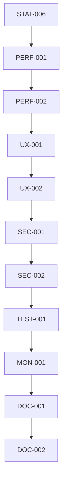

# v0.6.0 系统优化与完善任务分解

## 任务属性说明
每个任务包含以下属性：
- 任务ID：唯一标识符
- 任务名称：简短描述
- 任务描述：详细说明
- 相关文件：涉及的文件路径
- 依赖任务：前置任务ID
- AI提示词：用于生成代码的提示词

## 任务列表

### 1. 性能优化
#### 1.1 前端性能优化
- 任务ID: PERF-001
- 任务名称: 实现前端性能优化
- 任务描述: 优化前端加载速度、渲染性能等
- 相关文件:
  - next.config.js
  - src/app/layout.tsx
  - src/components/**/*.tsx
- 依赖任务: STAT-006
- AI提示词: "实现前端性能优化，包含以下功能：1. 组件懒加载 2. 图片优化 3. 代码分割 4. 缓存策略。使用Next.js优化特性。"

#### 1.2 后端性能优化
- 任务ID: PERF-002
- 任务名称: 实现后端性能优化
- 任务描述: 优化API响应速度、数据库查询等
- 相关文件:
  - src/app/api/**/*.ts
  - src/lib/db/index.ts
  - src/services/**/*.ts
- 依赖任务: PERF-001
- AI提示词: "实现后端性能优化，包含以下功能：1. 数据库索引优化 2. API缓存 3. 查询优化 4. 并发处理。使用Prisma和Node.js优化特性。"

### 2. 用户体验优化
#### 2.1 响应式设计优化
- 任务ID: UX-001
- 任务名称: 实现响应式设计优化
- 任务描述: 优化移动端、平板等设备的显示效果
- 相关文件:
  - src/components/**/*.tsx
  - src/app/**/*.tsx
- 依赖任务: PERF-002
- AI提示词: "实现响应式设计优化，包含以下功能：1. 移动端适配 2. 平板适配 3. 断点设计 4. 触摸交互。使用Tailwind CSS响应式特性。"

#### 2.2 交互体验优化
- 任务ID: UX-002
- 任务名称: 实现交互体验优化
- 任务描述: 优化用户操作流程、反馈效果等
- 相关文件:
  - src/components/**/*.tsx
  - src/hooks/**/*.ts
- 依赖任务: UX-001
- AI提示词: "实现交互体验优化，包含以下功能：1. 加载状态 2. 错误处理 3. 操作反馈 4. 动画效果。使用React和Tailwind CSS。"

### 3. 安全性优化
#### 3.1 安全漏洞修复
- 任务ID: SEC-001
- 任务名称: 实现安全漏洞修复
- 任务描述: 修复系统安全漏洞、加强安全防护
- 相关文件:
  - src/middleware.ts
  - src/lib/auth/**/*.ts
  - src/app/api/**/*.ts
- 依赖任务: UX-002
- AI提示词: "实现安全漏洞修复，包含以下功能：1. XSS防护 2. CSRF防护 3. SQL注入防护 4. 权限控制。使用Next.js安全特性。"

#### 3.2 数据安全优化
- 任务ID: SEC-002
- 任务名称: 实现数据安全优化
- 任务描述: 优化数据存储、传输安全性
- 相关文件:
  - src/lib/db/**/*.ts
  - src/services/**/*.ts
- 依赖任务: SEC-001
- AI提示词: "实现数据安全优化，包含以下功能：1. 数据加密 2. 敏感信息保护 3. 数据备份 4. 访问日志。使用Node.js安全特性。"

### 4. 测试与监控
#### 4.1 自动化测试
- 任务ID: TEST-001
- 任务名称: 实现自动化测试
- 任务描述: 实现单元测试、集成测试等
- 相关文件:
  - src/**/*.test.ts
  - src/**/*.test.tsx
  - jest.config.js
- 依赖任务: SEC-002
- AI提示词: "实现自动化测试，包含以下功能：1. 单元测试 2. 集成测试 3. 组件测试 4. API测试。使用Jest和React Testing Library。"

#### 4.2 系统监控
- 任务ID: MON-001
- 任务名称: 实现系统监控
- 任务描述: 实现系统运行状态监控、错误追踪等
- 相关文件:
  - src/lib/monitoring/**/*.ts
  - src/middleware.ts
- 依赖任务: TEST-001
- AI提示词: "实现系统监控，包含以下功能：1. 性能监控 2. 错误追踪 3. 用户行为分析 4. 系统健康检查。使用Node.js监控工具。"

### 5. 文档完善
#### 5.1 技术文档
- 任务ID: DOC-001
- 任务名称: 完善技术文档
- 任务描述: 完善API文档、开发文档等
- 相关文件:
  - docs/api/**/*.md
  - docs/development/**/*.md
- 依赖任务: MON-001
- AI提示词: "完善技术文档，包含以下内容：1. API文档 2. 开发指南 3. 部署文档 4. 架构说明。使用Markdown格式。"

#### 5.2 用户文档
- 任务ID: DOC-002
- 任务名称: 完善用户文档
- 任务描述: 完善用户使用手册、帮助文档等
- 相关文件:
  - docs/user/**/*.md
  - src/app/help/**/*.tsx
- 依赖任务: DOC-001
- AI提示词: "完善用户文档，包含以下内容：1. 用户手册 2. 常见问题 3. 使用教程 4. 帮助中心。使用Markdown格式。"

## 任务依赖关系
