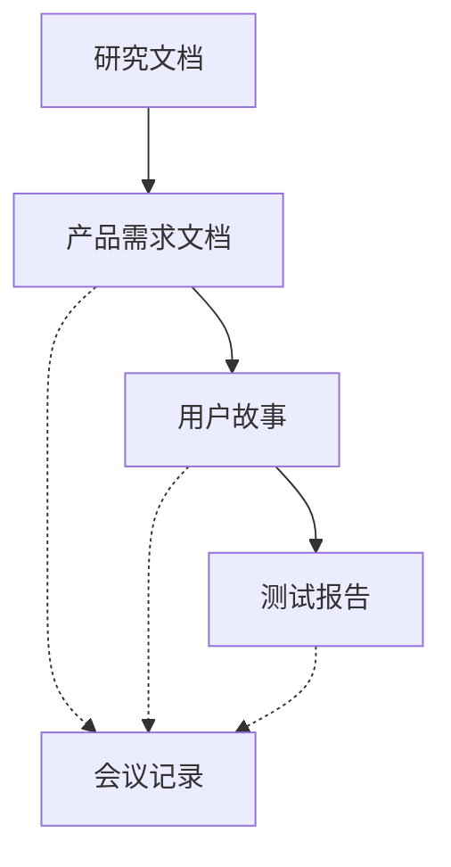

# 产品文档使用指南

## 文档体系概述

### 文档类型及用途
1. **产品需求文档 (PRD)**
   - 文件位置：`docs/prd/template.prd.md`
   - 使用场景：新功能规划、重大改版、产品迭代
   - 关键要素：KANO模型、MoSCoW优先级、用户故事地图
   - 使用频率：每个迭代/重要功能必需

2. **用户故事 (Story)**
   - 文件位置：`docs/prd/template.story.md`
   - 使用场景：功能细化、任务拆分、迭代规划
   - 关键要素：用户场景、验收标准、技术要点
   - 使用频率：每个功能点必需

3. **研究文档 (Research)**
   - 文件位置：`docs/research/template.research.md`
   - 使用场景：市场调研、竞品分析、用户研究
   - 关键要素：研究方法、数据分析、结论建议
   - 使用频率：重要决策前必需

4. **测试报告 (Test)**
   - 文件位置：`docs/test-reports/template.test.md`
   - 使用场景：功能测试、性能测试、兼容性测试
   - 关键要素：测试范围、问题统计、结论建议
   - 使用频率：每次发布必需

5. **会议记录 (Meeting)**
   - 文件位置：`docs/meeting-notes/template.meeting.md`
   - 使用场景：需求评审、设计评审、进度同步
   - 关键要素：议题讨论、决议事项、后续行动
   - 使用频率：每次会议必需

## 文档关联关系

### 文档流转流程


### 文档依赖关系
1. **研究文档 → PRD**
   - 研究结论作为PRD的输入
   - 用户需求映射到产品功能
   - 竞品分析指导功能设计

2. **PRD → 用户故事**
   - PRD功能点拆分为故事
   - 继承优先级和验收标准
   - 关联相应的设计资源

3. **用户故事 → 测试报告**
   - 验收标准转化为测试用例
   - 测试结果反馈到故事状态
   - 问题跟踪和解决方案

4. **会议记录 ↔ 其他文档**
   - 记录文档评审过程
   - 追踪决策和变更原因
   - 存档重要讨论结果

## 使用规范

### 命名规范
1. **文件命名**
   - PRD：`[项目代号]-[功能模块]-prd-v[版本号].md`
   - 故事：`[项目代号]-[功能点]-story-v[版本号].md`
   - 研究：`[研究主题]-research-[日期].md`
   - 测试：`[项目代号]-[测试类型]-test-v[版本号].md`
   - 会议：`[会议类型]-[主题]-meeting-[日期].md`

2. **版本号规则**
   - 主版本：重大变更，如v1.0.0
   - 次版本：功能更新，如v1.1.0
   - 修订版本：问题修复，如v1.1.1

### 状态标记
1. **文档状态**
   - 草稿：初始编写阶段
   - 评审中：等待或正在评审
   - 已评审：评审通过待执行
   - 已完成：执行完毕已归档

2. **任务状态**
   - 未开始：待处理
   - 进行中：正在执行
   - 已完成：已验收通过
   - 已取消：不再执行

### 评审流程
1. **评审前准备**
   - 完成文档编写
   - 自检文档质量
   - 准备补充材料

2. **评审中**
   - 记录评审意见
   - 标记需修改点
   - 确认修改方案

3. **评审后**
   - 完成文档修改
   - 更新文档状态
   - 归档评审记录

## 最佳实践

### PRD编写建议
1. **KANO模型应用**
   - 基本型：必须满足的基础需求
   - 期望型：用户明确表达的需求
   - 兴奋型：超出预期的创新需求

2. **MoSCoW优先级**
   - Must Have：必须完成
   - Should Have：应该完成
   - Could Have：可以完成
   - Won't Have：暂不考虑

### 用户故事编写建议
1. **故事格式**
   - 角色：明确用户身份
   - 行为：具体操作描述
   - 价值：实现的目标

2. **验收标准**
   - 具体：明确的预期结果
   - 可测：能够验证通过
   - 完整：覆盖所有场景

### 研究文档编写建议
1. **研究方法选择**
   - 定量：数据支撑
   - 定性：深度洞察
   - 混合：全面分析

2. **数据分析**
   - 数据收集：确保准确性
   - 分析方法：科学合理
   - 结论导出：有理有据

### 测试报告编写建议
1. **问题描述**
   - 现象：具体表现
   - 环境：复现条件
   - 影响：影响范围

2. **解决方案**
   - 临时方案：快速解决
   - 根本方案：彻底解决
   - 预防措施：避免复发

### 会议记录编写建议
1. **记录重点**
   - 决策过程：讨论要点
   - 行动项：具体任务
   - 时间节点：完成期限

2. **跟进管理**
   - 任务分配：明确责任人
   - 进度追踪：定期检查
   - 结果验收：确认完成

## 文档维护

### 定期更新
1. **更新时机**
   - 每次迭代结束
   - 重大变更发生
   - 定期复盘总结

2. **更新内容**
   - 状态更新
   - 进度更新
   - 问题更新

### 文档归档
1. **归档条件**
   - 项目完成
   - 阶段性总结
   - 历史版本存档

2. **归档方式**
   - 版本标记
   - 存档位置
   - 索引更新

## 工具使用

### Markdown编辑
1. **基础语法**
   - 标题：# ## ###
   - 列表：- * 1.
   - 表格：| --- |

2. **扩展语法**
   - 任务列表：- [ ]
   - 代码块：```
   - 流程图：mermaid

### 版本控制
1. **Git使用**
   - 分支管理
   - 提交规范
   - 冲突处理

2. **协作流程**
   - 权限管理
   - 评审流程
   - 合并规则 