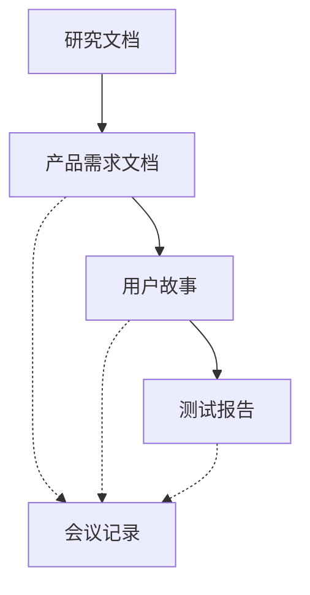

# 产品文档指南

## 1. 文档类型及用途

### 1.1 产品需求文档 (PRD)
- 文件位置：`docs/prd/template.prd.md`
- 使用场景：新功能规划、重大改版、产品迭代
- 关键要素：KANO模型、MoSCoW优先级、用户故事地图
- 使用频率：每个迭代/重要功能必需

### 1.2 用户故事 (Story)
- 文件位置：`docs/prd/template.story.md`
- 使用场景：功能细化、任务拆分、迭代规划
- 关键要素：用户场景、验收标准、技术要点
- 使用频率：每个功能点必需

### 1.3 研究文档 (Research)
- 文件位置：`docs/research/template.research.md`
- 使用场景：市场调研、竞品分析、用户研究
- 关键要素：研究方法、数据分析、结论建议
- 使用频率：重要决策前必需

## 2. 文档编写规范

### 2.1 PRD编写建议
1. KANO模型应用
   - 基本型：必须满足的基础需求
   - 期望型：用户明确表达的需求
   - 兴奋型：超出预期的创新需求

2. MoSCoW优先级
   - Must Have：必须完成
   - Should Have：应该完成
   - Could Have：可以完成
   - Won't Have：暂不考虑

### 2.2 用户故事编写建议
1. 故事格式
   - 角色：明确用户身份
   - 行为：具体操作描述
   - 价值：实现的目标

2. 验收标准
   - 具体：明确的预期结果
   - 可测：能够验证通过
   - 完整：覆盖所有场景

### 2.3 研究文档编写建议
1. 研究方法选择
   - 定量：数据支撑
   - 定性：深度洞察
   - 混合：全面分析

2. 数据分析
   - 数据收集：确保准确性
   - 分析方法：科学合理
   - 结论导出：有理有据

## 3. 文档管理流程

### 3.1 文档流转流程

### 3.2 文档依赖关系
1. 研究文档 → PRD
   - 研究结论作为PRD的输入
   - 用户需求映射到产品功能
   - 竞品分析指导功能设计

2. PRD → 用户故事
   - PRD功能点拆分为故事
   - 继承优先级和验收标准
   - 关联相应的设计资源

### 3.3 命名规范
1. 文件命名
   - PRD：`[项目代号]-[功能模块]-prd-v[版本号].md`
   - 故事：`[项目代号]-[功能点]-story-v[版本号].md`
   - 研究：`[研究主题]-research-[日期].md`

2. 版本号规则
   - 主版本：重大变更，如v1.0.0
   - 次版本：功能更新，如v1.1.0
   - 修订版本：问题修复，如v1.1.1

### 3.4 状态标记
1. 文档状态
   - 草稿：初始编写阶段
   - 评审中：等待或正在评审
   - 已评审：评审通过待执行
   - 已完成：执行完毕已归档

2. 任务状态
   - 未开始：待处理
   - 进行中：正在执行
   - 已完成：已验收通过
   - 已取消：不再执行

## 4. 评审与维护

### 4.1 评审流程
1. 评审前准备
   - 完成文档编写
   - 自检文档质量
   - 准备补充材料

2. 评审中
   - 记录评审意见
   - 标记需修改点
   - 确认修改方案

3. 评审后
   - 完成文档修改
   - 更新文档状态
   - 归档评审记录

### 4.2 文档维护
1. 更新时机
   - 每次迭代结束
   - 重大变更发生
   - 定期复盘总结

2. 更新内容
   - 状态更新
   - 进度更新
   - 问题更新

### 4.3 文档归档
1. 归档条件
   - 项目完成
   - 阶段性总结
   - 历史版本存档

2. 归档方式
   - 版本标记
   - 存档位置
   - 索引更新 