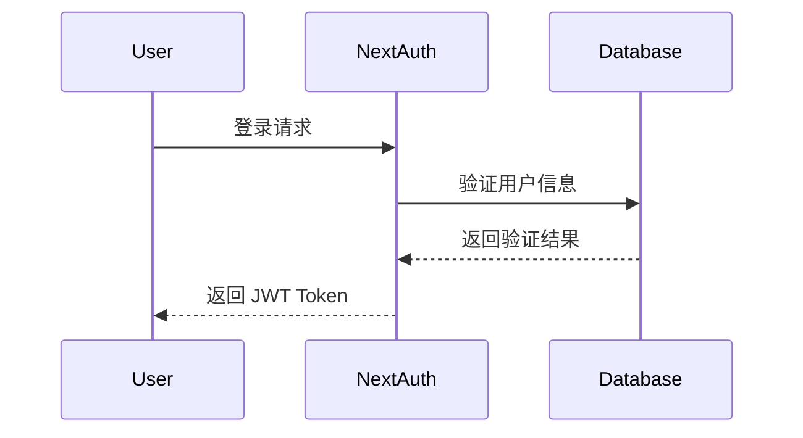
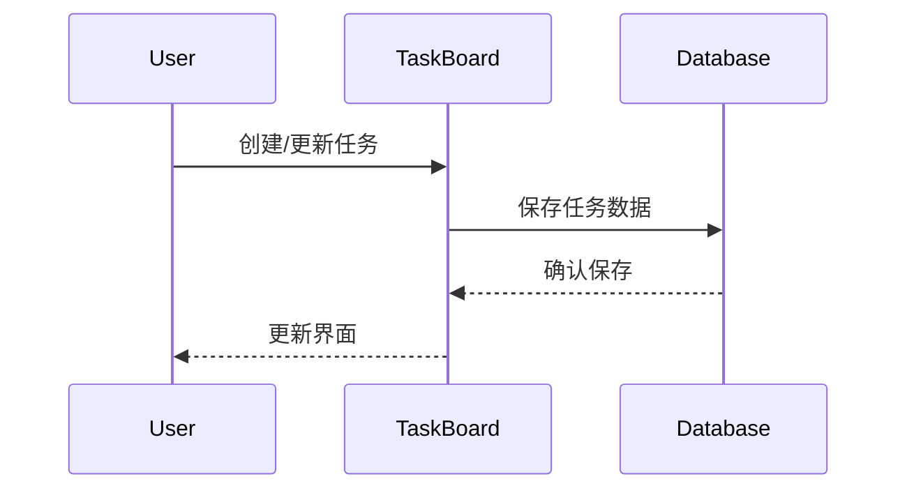

# 系统架构文档

## 1. 系统架构概述

### 1.1 技术栈
- 前端框架：Next.js
- 开发语言：TypeScript
- 样式方案：Tailwind CSS
- 数据库：SQLite
- ORM：Prisma
- 认证：NextAuth.js

### 1.2 系统模块
1. 任务看板模块
   - 看板视图
   - 任务卡片
   - 拖拽功能
2. 教务管理模块
   - 课程管理
   - 计划管理
   - 资源管理
3. 团队协作模块
   - 团队管理
   - 任务分配
   - 进度追踪

## 2. 数据流图

### 2.1 用户认证流程


### 2.2 任务管理流程


## 3. 组件结构

### 3.1 页面组件
```
app/
├── page.tsx                 # 首页
├── tasks/
│   ├── page.tsx            # 任务列表
│   └── [id]/
│       └── page.tsx        # 任务详情
├── teaching/
│   ├── page.tsx            # 教务管理
│   └── courses/
│       └── page.tsx        # 课程管理
└── team/
    └── page.tsx            # 团队管理
```

### 3.2 共享组件
```
components/
├── common/                 # 通用组件
│   ├── Button.tsx
│   ├── Input.tsx
│   └── Card.tsx
├── tasks/                  # 任务相关组件
│   ├── TaskCard.tsx
│   └── TaskList.tsx
└── teaching/              # 教务相关组件
    ├── CourseCard.tsx
    └── Schedule.tsx
```

## 4. 数据模型

### 4.1 用户模型
```prisma
model User {
  id        String   @id @default(cuid())
  email     String   @unique
  name      String
  role      Role     @default(USER)
  tasks     Task[]
  createdAt DateTime @default(now())
  updatedAt DateTime @updatedAt
}
```

### 4.2 任务模型
```prisma
model Task {
  id          String   @id @default(cuid())
  title       String
  description String?
  status      Status   @default(TODO)
  priority    Priority @default(MEDIUM)
  dueDate     DateTime?
  assigneeId  String
  assignee    User     @relation(fields: [assigneeId], references: [id])
  createdAt   DateTime @default(now())
  updatedAt   DateTime @updatedAt
}
```

## 5. 安全架构

### 5.1 认证机制
- JWT 基于令牌的认证
- 角色基础的访问控制
- 会话管理

### 5.2 数据安全
- 数据加密传输
- SQL 注入防护
- XSS 防护
- CSRF 防护

## 6. 性能优化

### 6.1 前端优化
- 组件懒加载
- 图片优化
- 缓存策略

### 6.2 后端优化
- 数据库索引
- 查询优化
- 缓存机制 