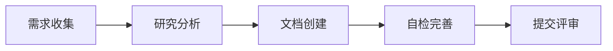
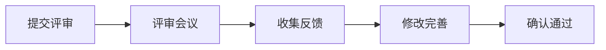
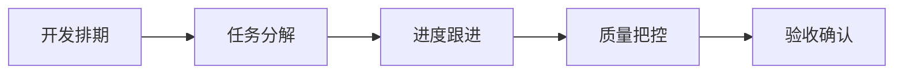
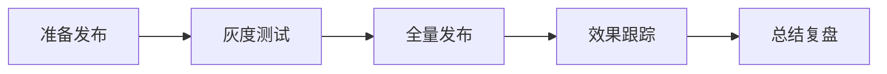

# 产品文档工作流程

## 文档生命周期

### 1. 创建阶段

#### 1.1 需求收集
- 收集用户反馈
- 分析市场需求
- 整理竞品信息
- 记录技术建议

#### 1.2 研究分析
- 进行可行性分析
- 评估技术难度
- 估算开发周期
- 计算投入产出

#### 1.3 文档创建
- 选择合适模板
- 按规范填写
- 补充必要附件
- 标注重点内容

#### 1.4 自检完善
- 检查完整性
- 验证准确性
- 确认规范性
- 优化表述

### 2. 评审阶段

#### 2.1 评审准备
- 准备评审材料
- 确定评审人员
- 安排评审时间
- 发送评审通知

#### 2.2 评审进行
- 主持评审会议
- 记录评审意见
- 讨论解决方案
- 达成共识

#### 2.3 评审跟进
- 整理评审结果
- 落实修改建议
- 跟进遗留问题
- 确认最终版本

### 3. 执行阶段

#### 3.1 开发准备
- 制定开发计划
- 分配开发资源
- 准备开发环境
- 确认技术方案

#### 3.2 过程管理
- 跟踪开发进度
- 协调资源调配
- 处理突发问题
- 控制项目风险

#### 3.3 质量控制
- 执行测试计划
- 验证功能完整
- 确保性能达标
- 检查兼容性

### 4. 发布阶段

#### 4.1 发布准备
- 制定发布计划
- 准备回滚方案
- 通知相关方
- 确认发布时间

#### 4.2 发布执行
- 执行发布流程
- 监控系统状态
- 处理异常情况
- 确认发布结果

#### 4.3 后续跟踪
- 收集用户反馈
- 监控关键指标
- 分析运营数据
- 总结经验教训

## 评审机制

### 1. 评审类型
#### 1.1 需求评审
- **参与人员**
  - 产品经理
  - 技术负责人
  - 设计师
  - 测试负责人
  
- **评审重点**
  - 需求合理性
  - 技术可行性
  - 开发工作量
  - 测试覆盖度

#### 1.2 设计评审
- **参与人员**
  - 设计师
  - 产品经理
  - 前端开发
  - 交互设计师
  
- **评审重点**
  - 视觉效果
  - 交互体验
  - 技术实现
  - 性能影响

#### 1.3 技术评审
- **参与人员**
  - 技术负责人
  - 开发工程师
  - 架构师
  - 运维人员
  
- **评审重点**
  - 技术方案
  - 系统架构
  - 性能优化
  - 安全考虑

### 2. 评审流程
#### 2.1 评审前
- 提前3天发出评审通知
- 准备评审材料
- 收集初步意见
- 制定会议议程

#### 2.2 评审中
- 主持人引导讨论
- 记录评审意见
- 收集改进建议
- 明确后续任务

#### 2.3 评审后
- 整理评审结论
- 跟进修改意见
- 确认修改结果
- 存档评审记录

## 文档更新规则

### 1. 更新时机
#### 1.1 定期更新
- 每周进度更新
- 每月状态检查
- 每季度版本更新
- 年度总结更新

#### 1.2 触发更新
- 需求变更
- 设计调整
- 技术改造
- 问题修复

### 2. 更新流程
#### 2.1 更新前
- 备份原文档
- 收集更新内容
- 评估更新影响
- 通知相关方

#### 2.2 更新中
- 按规范修改
- 标注更新内容
- 更新版本号
- 记录更新说明

#### 2.3 更新后
- 通知相关方
- 存档旧版本
- 更新索引
- 同步关联文档

## 文档管理规范

### 1. 版本控制
#### 1.1 版本号规则
- 主版本号：重大变更
- 次版本号：功能更新
- 修订号：问题修复
- 日期标记：年月日

#### 1.2 分支管理
- master：稳定版本
- develop：开发版本
- feature：功能分支
- hotfix：修复分支

### 2. 权限控制
#### 2.1 访问权限
- 管理员：全部权限
- 编辑者：编辑权限
- 审阅者：评论权限
- 访客：查看权限

#### 2.2 操作权限
- 创建文档
- 编辑文档
- 删除文档
- 管理权限

### 3. 存储规范
#### 3.1 存储位置
- 在线文档
- 本地备份
- 版本仓库
- 归档存储

#### 3.2 命名规则
- 项目代号
- 文档类型
- 版本编号
- 日期标记

## 质量保证

### 1. 文档审核
#### 1.1 审核维度
- 完整性
- 准确性
- 规范性
- 可读性

#### 1.2 审核方法
- 自动检查
- 人工审核
- 交叉评审
- 专家评审

### 2. 问题跟踪
#### 2.1 问题分类
- 内容错误
- 格式问题
- 链接失效
- 版本冲突

#### 2.2 处理流程
- 问题记录
- 分配责任人
- 跟踪解决
- 验证结果

## 工具与资源

### 1. 推荐工具
#### 1.1 文档工具
- Markdown编辑器
- 版本控制系统
- 协作平台
- 图表工具

#### 1.2 管理工具
- 项目管理
- 任务跟踪
- 进度监控
- 团队协作

### 2. 模板资源
#### 2.1 文档模板
- 产品需求
- 设计文档
- 技术方案
- 测试报告

#### 2.2 规范指南
- 写作规范
- 格式规范
- 命名规范
- 流程规范 